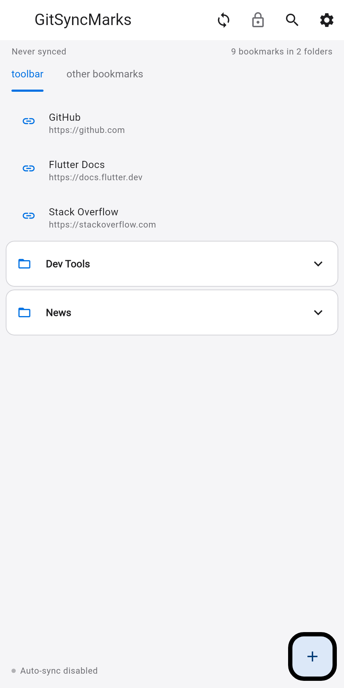
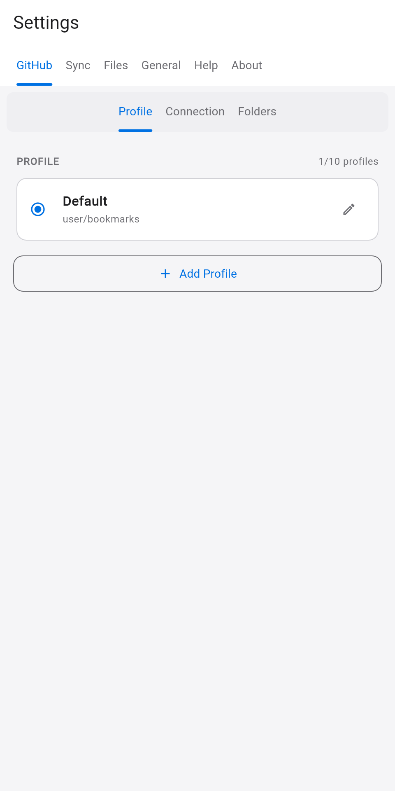

<p align="center">
  
</p>

<h1 align="center">GitSyncMarks-Mobile</h1>

<p align="center">
  <a href="https://github.com/d0dg3r/GitSyncMarks-Mobile/releases"></a>
  <a href="https://github.com/d0dg3r/GitSyncMarks-Mobile/releases?q=pre"></a>
</p>

<p align="center">
  Cross-platform app (Android, iOS, Windows, macOS, Linux) that syncs bookmarks from your GitHub repo and opens URLs in your preferred browser.<br>
  Companion to the <a href="https://github.com/d0dg3r/GitSyncMarks">GitSyncMarks</a> browser extension. Supports move, reorder, add via share (mobile), and encrypted settings sync.
</p>

<p align="center">
  <a href="https://f-droid.org/packages/com.d0dg3r.gitsyncmarks"></a>
  <a href="https://github.com/d0dg3r/GitSyncMarks-Mobile/releases"></a>
  <a href="http://apps.obtainium.imranr.dev/redirect.html?r=obtainium://add/https://github.com/d0dg3r/GitSyncMarks-Mobile/releases"></a>
</p>

<p align="center">
  <strong>Why GitSyncMarks-Mobile?</strong> View your <a href="https://github.com/d0dg3r/GitSyncMarks">GitSyncMarks</a> bookmarks on mobile. Uses the same per-file format — bookmarks live in <em>your</em> Git repo. Sync once, browse offline. Works with the browser extension's bookmark structure (toolbar, menu, other, mobile).
</p>

<p align="center">
  
  
  
</p>

See [CHANGELOG.md](CHANGELOG.md) for version history and [ROADMAP.md](ROADMAP.md) for milestones and future plans.

## Features

- **Sync from GitHub**: Bookmarks from your GitSyncMarks-compatible repository via Contents API
- **Settings Sync to Git**: Encrypted sync (extension-compatible), Global/Individual mode, Import from other device
- **Move bookmarks**: Long-press to move bookmarks to any folder (including subfolders)
- **Reorder bookmarks**: Drag-and-drop to reorder; changes persisted to repo
- **Delete bookmarks**: Long-press to delete (available even when edit mode is locked)
- **Share link as bookmark** (Android/iOS): Add shared URLs from browser or other apps as bookmarks; on desktop use "Add bookmark" dialog
- **Password-protected export/import**: Export settings with AES-256-GCM encryption; import detects encrypted files and prompts for password
- **Configurable root folder**: Select any folder as "root" for tab navigation
- **Auto-lock edit mode**: Edit mode auto-locks after 60 seconds of inactivity
- **Reset all data**: Clear all profiles, settings, and cached data from the About tab
- **Local cache**: Bookmarks saved after sync, loaded from cache on app start (offline-capable)
- **GitHub Personal Access Token**: Secure authentication with `repo` scope
- **Folder selection**: Choose which root folders to display (toolbar, menu, mobile, other)
- **Favicons**: Via DuckDuckGo API
- **Pull-to-refresh**: Manual sync when you need it
- **Light and Dark mode**: Follows system theme (GitSyncMarks branding)
- **i18n**: German, English, Spanish, French
- **Settings | About | Help**: All in one tabbed screen

## Installation

### Android

1. Go to the [Releases page](https://github.com/d0dg3r/GitSyncMarks-Mobile/releases)
2. Download `GitSyncMarks-Mobile-X.X.X.apk` (or a pre-release build for testing)
3. Open the file on your Android device (allow from unknown sources if prompted)
4. Install the app

### Linux (Flatpak, recommended)

1. Download `GitSyncMarks-Mobile-vX.X.X.flatpak` from [Releases](https://github.com/d0dg3r/GitSyncMarks-Mobile/releases)
2. Install:
   ```bash
   flatpak install --user ./GitSyncMarks-Mobile-vX.X.X.flatpak
   ```
3. Run:
   ```bash
   flatpak run io.github.d0dg3r.GitSyncMarksMobile
   ```

### Linux (ZIP fallback)

1. Download `GitSyncMarks-Mobile-X.X.X-linux-x64.zip` from [Releases](https://github.com/d0dg3r/GitSyncMarks-Mobile/releases)
2. Extract and run:
   ```bash
   unzip GitSyncMarks-Mobile-X.X.X-linux-x64.zip -d GitSyncMarks-Mobile
   cd GitSyncMarks-Mobile
   ./gitsyncmarks_app
   ```

### Windows / macOS

Download the respective `.zip` from [Releases](https://github.com/d0dg3r/GitSyncMarks-Mobile/releases), extract, and run the executable.

### Configure the app

1. Open the app and go to **Settings** (first tab)
2. Enter your **Personal Access Token** (create one at [GitHub Settings > Tokens](https://github.com/settings/tokens/new?scopes=repo&description=GitSyncMarks+Sync) with `repo` scope)
3. Enter **Repository Owner** and **Repository Name** (your bookmark repo)
4. Set **Branch** (usually `main`) and **Base Path** (default `bookmarks` — must match your [GitSyncMarks](https://github.com/d0dg3r/GitSyncMarks) extension config)
5. Select which folders to display (toolbar, menu, other, mobile)
6. Click **Test Connection** to verify, then **Save**
7. Use **Sync Bookmarks** to fetch your bookmarks

## Project References

The bookmark format comes from [GitSyncMarks](https://github.com/d0dg3r/GitSyncMarks). Your repo should use folders like `toolbar`, `menu`, `other`, `mobile` with JSON files per bookmark. The app supports moving, reordering, and adding bookmarks. Settings can be synced encrypted (extension-compatible). For full bidirectional sync, use the [browser extension](https://github.com/d0dg3r/GitSyncMarks).

## Prerequisites (Development)

- [Flutter SDK](https://docs.flutter.dev/get-started/install) (3.41.0 or later)

## Setup (Development)

1. **Install Flutter**:
   ```bash
   # Arch Linux / CachyOS
   paru -S flutter
   # or: https://docs.flutter.dev/get-started/install
   ```

2. **Get dependencies**:
   ```bash
   cd GitSyncMarks-Mobile
   flutter pub get
   ```

3. **Run on device/emulator**:
   ```bash
   flutter run -d android
   flutter run -d linux      # Linux desktop
   flutter run -d windows    # Windows (on Windows host)
   flutter run -d macos     # macOS (on macOS host)
   ```

4. **Build standalone executable** (no Flutter runtime needed):
   ```bash
   flutter build linux      # → build/linux/x64/release/bundle/
   flutter build windows    # → build/windows/x64/runner/Release/ (Windows host only)
   flutter build macos     # → build/macos/Build/Products/Release/ (macOS host only)
   ```

5. **Regenerate screenshots** (optional, vor Release):
   ```bash
   ./scripts/generate-screenshots.sh
   ```

## Releases

Releases are built automatically on tag push (`v*`). All tags trigger builds for all platforms.

```bash
# Stable release (marked as "latest")
git tag v0.3.0 && git push origin v0.3.0

# Pre-release (visible under Releases, but not marked as "latest")
git tag v0.3.0-beta.1 && git push origin v0.3.0-beta.1
```

**Tag convention:**
- `v1.2.3` — stable release, marked as "latest"
- `v1.2.3-beta.1`, `v1.2.3-rc.1`, `v1.2.3-test.1` — pre-release (any tag with `-` suffix)

Artifacts appear under [Releases](https://github.com/d0dg3r/GitSyncMarks-Mobile/releases): APK (Android), Flatpak + ZIP (Linux), ZIP (Windows, macOS).

### Flatpak-only test

To test the Flatpak build without running the full release workflow (Windows, macOS, release job):

- **Manual**: Go to Actions → "Flatpak test" → Run workflow
- **Tag**: Push `v0.3.0-flatpak-test.1` (or any `v*-flatpak-test*` tag)

This runs only `build-android-linux` and `build-flatpak`. The `.flatpak` artifact can be downloaded from the workflow run.

## Platform Status

| Platform | Status | Notes |
|----------|--------|-------|
| Android  | **Stable** | Primary platform, actively developed |
| Windows  | Alpha | Built from same codebase, developed as time permits |
| Linux    | Alpha | Flatpak + ZIP; developed as time permits |
| macOS    | Alpha | Built from same codebase, developed as time permits |
| iOS      | Alpha | Built from same codebase; no CI build yet (requires macOS runner) |

Android is the main focus. All other platforms share the same Flutter codebase and are maintained on a best-effort basis -- contributions welcome!

## Documentation

- **[docs/README.md](docs/README.md)** — Project context and continuation guide
- **[docs/PLAN.md](docs/PLAN.md)** — Implementation phases
- **[docs/BOOKMARK-FORMAT.md](docs/BOOKMARK-FORMAT.md)** — Bookmark JSON structure
- **[store/README.md](store/README.md)** — App store submission (descriptions, screenshots)
- **[CHANGELOG.md](CHANGELOG.md)** — Version history
- **[ROADMAP.md](ROADMAP.md)** — Milestones and future plans

## License

[MIT](LICENSE)
